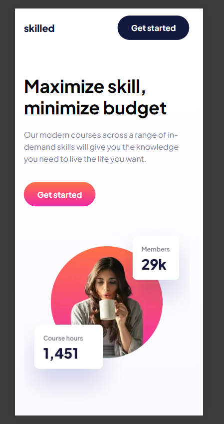
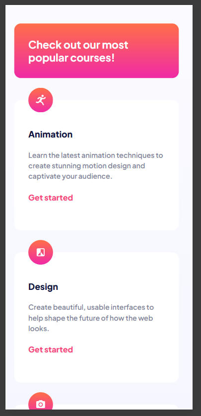
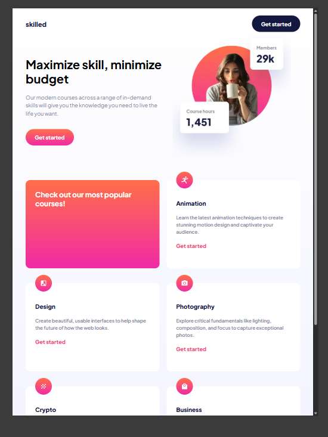
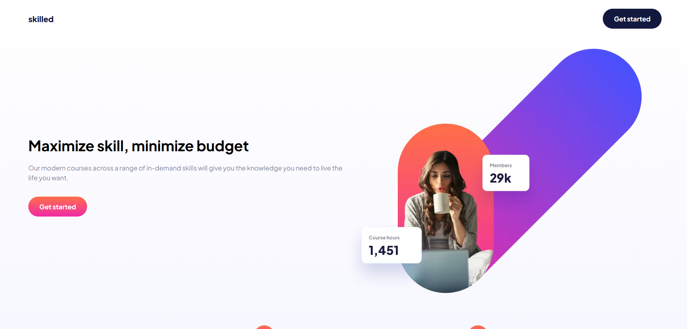

# Frontend Mentor - Skilled e-learning landing page solution

This is a solution to the [Skilled e-learning landing page challenge on Frontend Mentor](https://www.frontendmentor.io/challenges/skilled-elearning-landing-page-S1ObDrZ8q). Frontend Mentor challenges help you improve your coding skills by building realistic projects.

## Table of contents

-   [Overview](#overview)
-   [The challenge](#the-challenge)
-   [Screenshot](#screenshot)
-   [Links](#links)

## Overview

A responsive, modern landing page built as a solution to the Frontend Mentor “Skilled e-learning” challenge. It showcases:

Semantic HTML5 structure with clear headings and accessible markup

Responsive images via <picture>, WebP formats and 1×/2× srcset for Retina displays

Fluid, mobile-first CSS using custom properties, rem units and CSS Grid for card layouts

Enhanced UX with scroll-behavior: smooth, hover/focus transitions and optimized cursor: pointer

### The challenge

Users should be able to:

-   View the optimal layout depending on their device's screen size
-   See hover states for interactive elements

### Screenshot

### Links

-   Live Site URL: [skilled-page](https://silver-brigadeiros-741327.netlify.app/)

## My process

### Built with

-   **HTML5** for semantic, accessible markup
-   **CSS3** including custom properties, rem units, Flexbox and Grid layouts
-   **Responsive images** using the `<picture>` element with WebP formats and 1×/2× `srcset`
-   **Smooth scrolling** via `scroll-behavior: smooth`
-   **Hover and focus states** with CSS transitions
-   **Google Fonts** (Plus Jakarta Sans)
